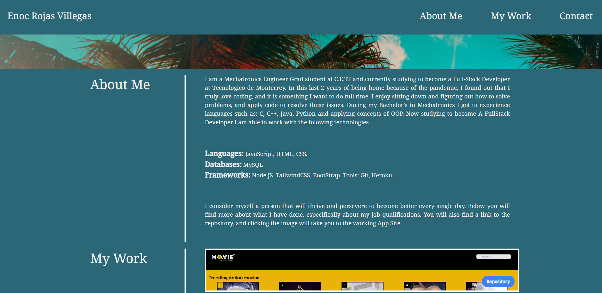
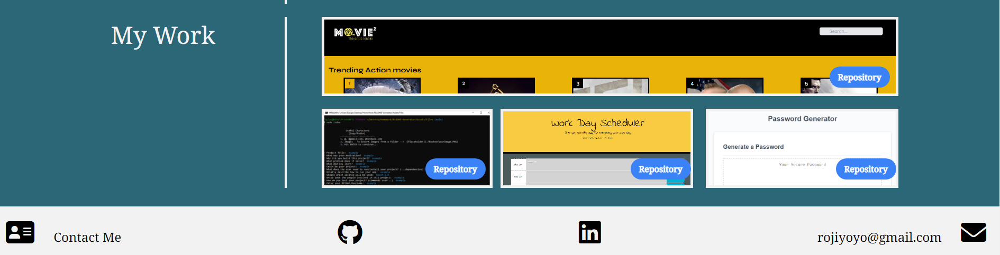

# Personal Portfolio

This is my landing page to showcase the projects I have done by myself and with other team members. This application includes a description about me, and short description of who I am.  
 
It includes the tools I have learned to use, such as Languages, Databases, and other significant technologies.
This part will be updated when a new tool is learnes, and also add the different time of experience with each technology. 
 
Working App: https://enrique-rojas-villegas.github.io/Personal_Portfolio/
 

Sections included:

1. About Me
2. My Work
3. Conctact Information

Tools used in this project:
-Tailwind CSS: for the grid and row functionality, as well as media queries.
-Pure CSS: To style more specific elements, and not have Tailwind overrride them.
-Each section is linkd to the navbar for easier access.
-Each project has corresponding links to be accessed.
-Footer has contact info, and links as well for GitHub and LinkedIN.

Below you will find some Screenshots of the site.  
 

